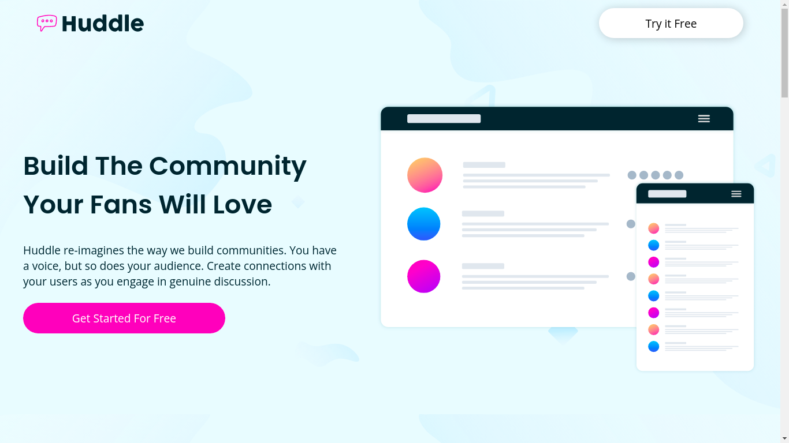
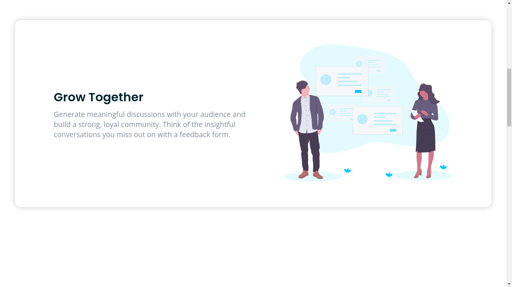
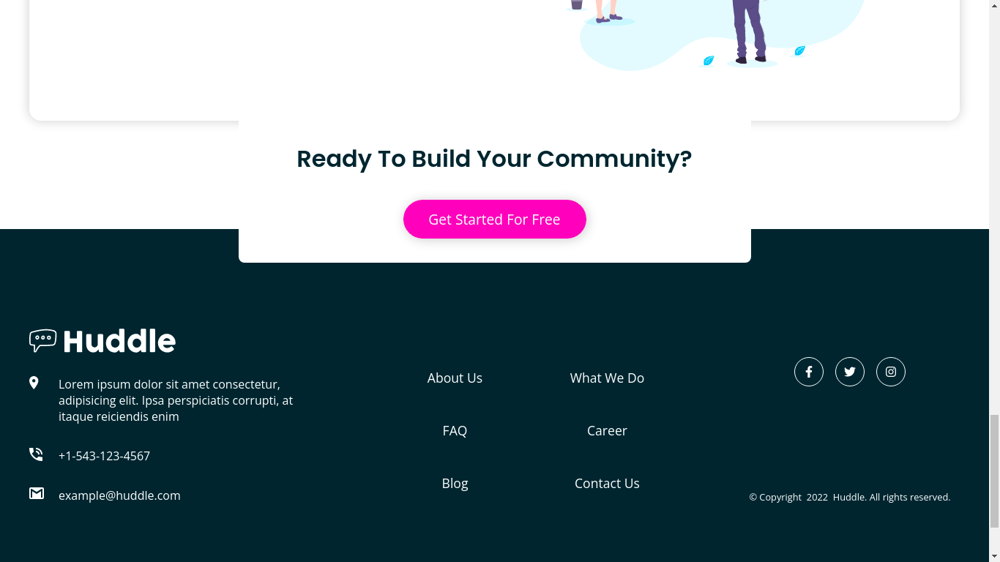

# README

<h1 align="center">Huddle Landing Page</h1>

<h1></h1>
<h1></h1>
<h1></h1>
<h1 align="center"></h1>

<h2 align="center">Tabela de conteúdos</h2>
<p align="center">
  <a href="#sobre">Sobre</a> |
  <a href="#pré-requisitos">Pré-requisitos</a> |
  <a href="#instalação">Instalação</a> |
  <a href="#tecnologias">Tecnologias</a>
</p>

## ❔ Sobre
<p>Landing Page criada com React, Typescript e Styled-components</p>

## 📝 Pré-Requisitos

Antes de iniciar o projeto, você vai precisar ter instalado na sua máquina as seguintes ferramentas:

- [Git](https://git-scm.com)
- [Node.js](https://nodejs.org)

Além disto para editar algo no projeto utilize o [Visual&nbsp;Studio&nbsp;Code](https://code.visualstudio.com/) como editor de Código.

## ✅ Instalação

```bash
# Clone este repositório
$ git clone https://github.com/DanteBenicio/huddle-landing-page-react
# Acesse a pasta do projeto
$ cd huddle-landing-page-react
# Instale as dependências (Yarn)
$ yarn
# Execute a aplicação (Yarn)
$ yarn dev
# O servidor iniciará na URL (Porta 3000) - http://localhost:3000/
```

## ✨ Tecnologias

- [React](https://reactjs.org.com)
- [Typescript](https://typescriptjs.org.com)
- [Styled-components](https://styled-componentsjs.org.com)